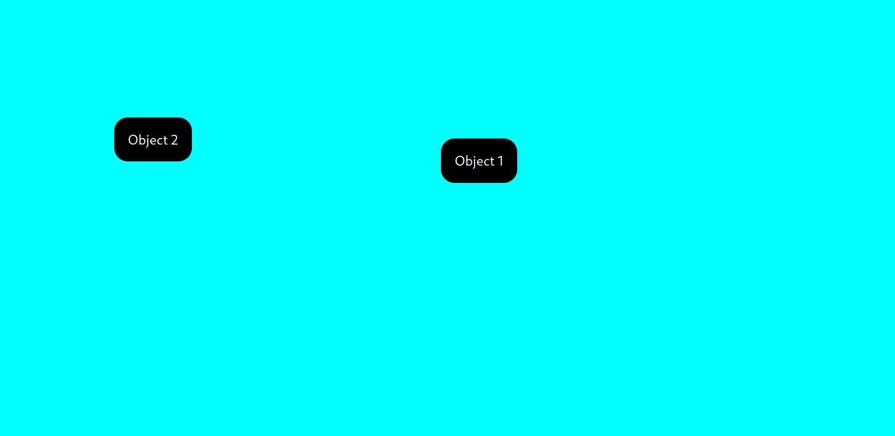

[](https://badge.fury.io/js/angular2-expandable-list)
[](https://github.com/prettier/prettier)

# Draggedro

> Now you can add drag and drop to your website easily with just including the components

<!-- ## Prerequisites

This project requires NodeJS (version 8 or later) and NPM.
[Node](http://nodejs.org/) and [NPM](https://npmjs.org/) are really easy to install.
To make sure you have them available on your machine,
try running the following command.

```sh
$ npm -v && node -v
6.4.1
v8.16.0
``` -->

## Table of contents

- [Draggedro](#draggedro)
  <!-- - [Prerequisites](#prerequisites) -->
  <!-- - [Table of contents](#table-of-contents) -->
  - [Getting Started](#getting-started)
  - [Installation](#installation)
  - [Components](#components)
    - [PannelAllowScreen](#pannelallowscreen)
      - [Props](#props)
  - [Contributing](#contributing)
  - [Built With](#built-with)
  - [Authors](#authors)

## Getting Started

These instructions will get you a copy of the project up and running on your local machine for development and testing purposes. See deployment for notes on how to deploy the project on a live system.

## Installation

<!-- **BEFORE YOU INSTALL:** please read the [prerequisites](#prerequisites) -->

To install and set up the library, run:

```sh
$ npm install -S dragge-dro-react
```

Or if you prefer using Yarn:

```sh
$ yarn add --dev dragge-dro-react
```


## Components

### PannelAllowScreen

```html
<PannelAllowScreen>
    children...
</PannelAllowScreen>
```

Supported props for `PannelAllowScreen` component are listed below.

#### Props

- children -> JSX.Element[]: Elements needed to be draggable

    > Note: The child components of the elements passed as children will not be 
    draggable

- React.CSSProperties: Any react css property can be passed as a prop to this component

    >Note: `width` and `height` will not have any effect on this component, Its width and height are set to `100vw` and `100vh` respectively

Example:

```tsx
const MyComponent: React.FC = () => {

	const itemStyle: React.CSSProperties = {
		padding: '1rem',
		backgroundColor: 'black',
		display: 'inline-block',
		borderRadius: '1rem',
		width: "inline",
	};
    return (
    <PannelAllowAnywhere background="cyan">
        <div style={itemStyle}>Object 1</div>
	    <div style={itemStyle}>Object 2</div>
	</PannelAllowAnywhere>
	
  );
};
```
Output:



## Contributing

<!-- Please read [CONTRIBUTING.md](CONTRIBUTING.md) for details on our code of conduct, and the process for submitting pull requests to us. -->

1.  Fork it!
2.  Create your feature branch: `git checkout -b my-new-feature`
3.  Add your changes: `git add .`
4.  Commit your changes: `git commit -am 'Add some feature'`
5.  Push to the branch: `git push origin my-new-feature`
6.  Submit a pull request :sunglasses:

## Built With

* React
* Rollup
* Storybook
* Love

## Authors

* **Pravith B A** - *Initial work* - [Pravith](https://github.com/PravithBA)

